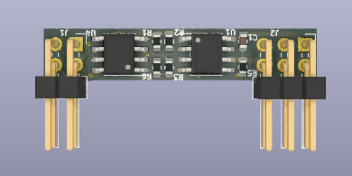

# A small STM8S001 Break-Out Board with RS485 and DS1621S Thermometer

This KiCad project provides a small PCB with an STM8S001J3M3, a RS485 interface and a DS1621S temperature sensor. Applications include [MODBUS with STM8 eForth](https://github.com/TG9541/stm8ef-modbus).

The STM8S001J3M3 is a member of the "STM8S Low Density" family that's based on the "STM8S Access Line" cross-breed STM8S903, which, compared with the STM8S003, has some ([undocumented](https://github.com/TG9541/stm8ef/wiki/STM8-Low-Density-Devices#stm8s001j3)) goodies.

The board is supported by [STM8 eForth](https://github.com/TG9541/stm8ef/) which means that it runs an interactive development system on the chip: the serial interface for the console can either use RS485, or a two-wire interface on the GPIO PC5.

A µC with merrily 5 GPIO pins is a good shield against feature creep, but the following things "had" to be included:

* most GPIOs, including the I2C bus (PB4 & PB5), and an analog input or timer output (PC5) and the are available on 6 pin header
* a narrow PCB for a cylindrical sensors with a diameter of 7mm
* 5V nominal supply, internal 3.3V power supply with an LDO regulator
* signalling LEDs for RS485 activity (RxTx) and direction (Tx)

Care should be taken not to exceed 6V input supply voltage. The internal 3.3V power supply is available on the header pin J2.1 (it should be able to support about 150mA).

## Design

The design is simple: The STM8S001J3 controls the direction of the SP3485 with PA1/PD6. R3 makes sure that the SWIM interface is still usable when the SP3485 is in "/RE" mode (i.e. listening for RS485 communication).

The RS485 communcation direction is "send" when LED D1 is active. Communication is indecated by pulses on LED D2. Bright pulsing means read, and dim pulses means write. R4 is the (optional) RS485 termination resistor.

The BOM is in the docs folder.

## Pin Headers

Pin headers are also optional: they allow the board to be used as a module for quickly building a MODBUS node with a "perfboard" (using I2C or GPIOs), but connecting wires directly is also an intended use case.

### Description Header J1
Pin|Signal
-|-
1|3.4 to 6V for XC6206 3.3V LDO regulator
2|GND
3|RS485 "A" (optional 120R termination)
4|RS485 "B"

### Description Header J2
Pin|Tag|Pin STM8S001|GPIO|Features
-|-|-|-|-
1|3.3|4|VDD|3.3V from LDO regulator
2||8|PC6 | SPI_MOSI, [TIM1_CH1]
2|SWIM|8|PD1 | **SWIM**
2||8|PD3 | TIM2_CH2, TIM2_CH2, ADC_ETR
2||8|PD5 | **UART1_TX**, AIN5
3||5|PA3 | TIM2_CH3, [SPI_NSS], [UART1_TX]
3|SDA|5|PB5 | **I2C_SDA**
4||7|PC3 | TIM1_CH3, [TLI], [TIM1_CH1N]
4||7|PC4 | TIM1_CH4, CLK_CCO, AIN2, [TIM1_CH3]
4|PC5|7|PC5 | SPI_SCK, [TIM2_CH1]
5|SCL|6|PB4 | **I2C_SCL**, [ADC_ETR]
6|GND|2|VSS|GND

## PCB and Assembly

Components occupy both sides of a PCB of 33.4mm x 1/4" (the minimal width supported by Oshpark).

On the front side there is the STM8S001J3M3, a XC6206 3.3V LDO regulator, some passive components, and the RS485 signalling LEDs:

A generic 3.3V RS485 transceiver (like SP3485 or MAX3485l) and the (optional) DS1621S thermometer chip are on the backside:

